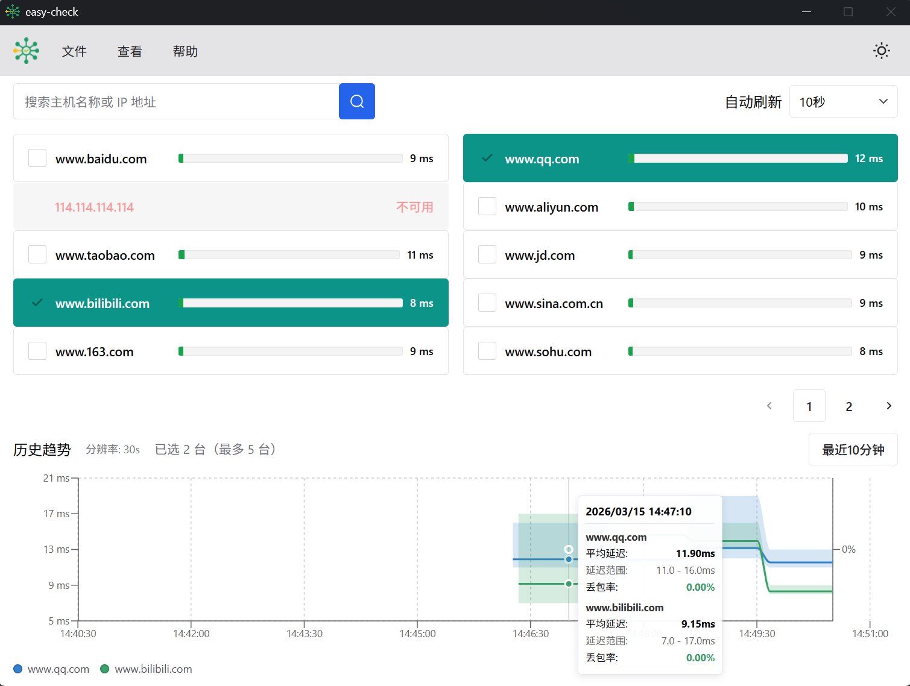

# easy-check

> 一个面向 Linux / Windows 的桌面网络巡检工具，用来持续检测关键主机连通性，并在异常与恢复时主动通知你。

  

## 它解决什么问题

当你需要长期观察网络是否稳定时，`ping` 命令很好用，但手动盯着终端并不现实。

`easy-check` 的目标是把这件事做成一个真正能长期运行的桌面工具：

- 周期性检测多个目标主机
- 记录失败、恢复和时间线
- 支持聚合告警，避免消息轰炸
- 适合作为日常网络巡检、小型值守或桌面常驻工具

## 核心能力

- **桌面 UI**：基于 Wails 构建，适合日常直接查看状态
- **多目标定时检测**：按配置周期性 `ping` 多个主机
- **可调检测策略**：支持配置次数、超时、失败率阈值、检测间隔
- **异常 / 恢复通知**：当前支持飞书机器人告警
- **聚合告警**：同一批异常可汇总发送，减少噪音
- **配置热更新**：修改 `configs/config.yaml` 后自动生效
- **日志滚动**：支持日志文件大小、天数、备份数量等策略
- **本地数据存储**：支持本地数据库与时序数据保留
- **开机自启动**：支持 Linux / Windows 安装与卸载脚本

## 适用场景

- 办公室网络出口稳定性巡检
- 家庭宽带、NAS、旁路设备的连通性观察
- 小型服务器、内网关键节点可达性监控
- 需要“轻量桌面值守工具”而不是完整监控平台的场景

## 快速开始

### 1. 配置监控目标

编辑 `configs/config.yaml`，配置待检测主机、检测频率、日志和告警方式。

最常改的是这些配置项：

- `hosts`：要检测的目标列表
- `ping.count` / `ping.timeout` / `ping.loss_rate`：检测策略
- `interval` 或 `ping.interval`：检测间隔
- `alert.notifiers`：告警通知方式

### 2. 本地开发运行

开发模式运行桌面界面：

- `task dev`

### 3. 构建与打包

构建 UI 与命令行版本：

- `make build`

打包可分发产物：

- `make package`

构建完成后，产物会出现在 `bin/`、`build/` 或打包 zip 中。

### 4. 安装开机自启

根据系统选择脚本：

- Linux：`scripts/install.sh`
- Windows：`scripts/install.bat`

卸载同理：

- Linux：`scripts/uninstall.sh`
- Windows：`scripts/uninstall.bat`

## 日志与数据

- 日志默认写入：`logs/check-log.txt`
- 本地数据库目录：`db/`
- 数据保留策略可在 `configs/config.yaml` 中调整

## 项目结构

- `configs/`：主配置文件
- `scripts/`：安装 / 卸载脚本
- `docs/`：补充文档
- `frontend/`：桌面 UI 前端
- `internal/`：核心业务逻辑
- `cmd/`：命令行入口

## 文档

- [文档索引](./docs/README.md)
- [开机自启说明](./docs/01-autostart.md)
- [Machine ID 模块说明](./docs/02-machineid.md)

## 当前通知支持

- 飞书机器人

如果后续需要扩展企业微信、钉钉、邮件等通知方式，这个结构也比较方便继续加。

## 贡献

欢迎 Issue、建议和 Pull Request。
